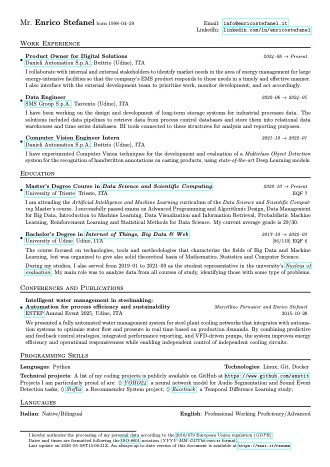

### Hello, World! 👋🏼

My name is Enrico, and I am a Product Manager for Digital Solutions in the metal industry from Italy (for a little less
than half I am Canadian too, to be honest!).

I am currently attending the Master's Degree Course in _Data Science and
Scientific Computing_ at [University of Trieste](https://www.units.it/en), where
I am following the _Artificial Intelligence and Machine Learning_ curriculum.

I am also working as Product Manager in the metals industry at [Danieli
Automation S.p.A.](https://www.dca.it). In particular, I am working on the
development of an Energy Management System (EMS).

I don't like social networks so much, so if you want to reach me you can connect
with me on [LinkedIn](https://enst.it/in) or you can
send me an [e-mail](mailto:me@enst.it?subject=[GitHub]%20Greetings).

My favorite quote is:

> There are two types of people in this world: those who see things happen, and
> those who make things happen.

See you around!
